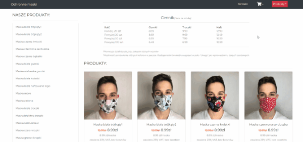

 
 

# Ochronne Maski

E-commerce website for a local company selling reusable masks in variety designs and materials. I had built and deploy the entire platform from scratch.

#### The application alows user to:
- browse masks
- manage cart operation (adding, deleting)
- place orders with the form validation
- use of discounts in case of order larger quantity of masks

#### Orders panel allows to:
- manage placed orders
- place orders with the manage the status of orders

## Demo
~~Here is a website link: http://www.ochronne-maski.pl/~~
* ORIGINAL WEBSITE NOT AVAILABLE ALREADY (CLIENT DOES NOT SELL MASK NOW) 
* Here is a backup demo link: https://maseczkiochronne.herokuapp.com/

## Technologies
Full-stack application utilising a MERN stack.

#### FRONT-END APP
- SPA done in React & plain CSS
- implements form validations
- uses Bootstrap
- sends API requests to server

#### BACK-END SERVER
- done in NodeJS with MongoDB
- handles all the API requests
- serves front-end web app
Application is automatically deployable via Git to Heroku.
## Getting Started

1. Run `npm install`
2. Go to client directory `cd client`
3. Run `npm install`
3. Go to parent directory and run `npm run dev`
4. Open http://localhost:3000 to view it in the browser.

The page will automatically reload if you make changes to the code.
You will see the build errors and lint warnings in the console.
